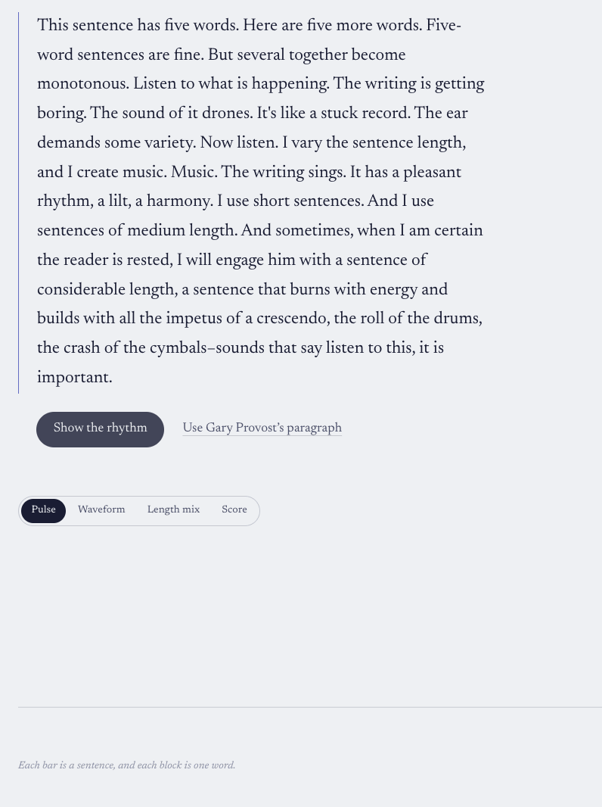
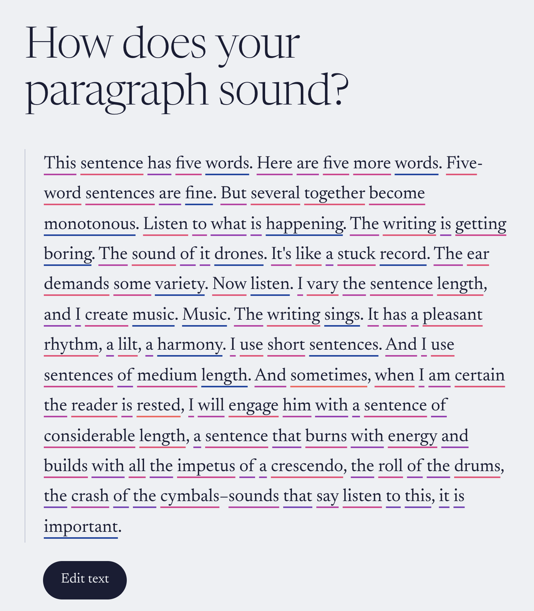
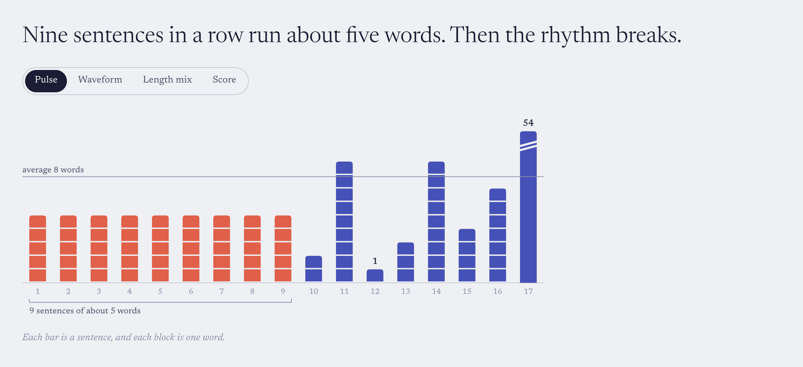
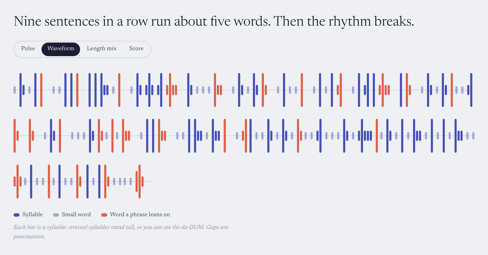
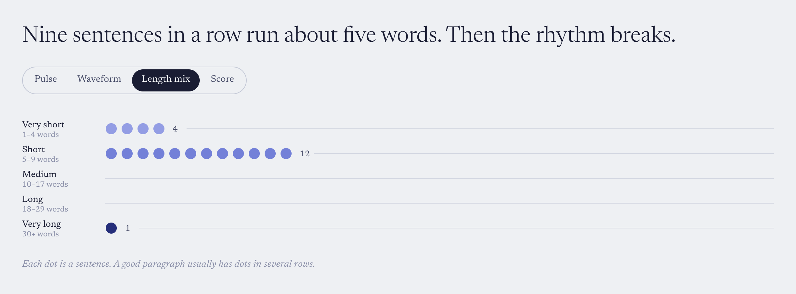
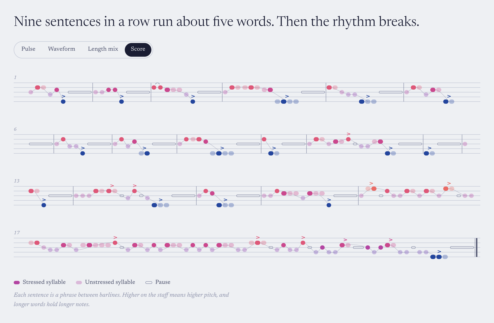
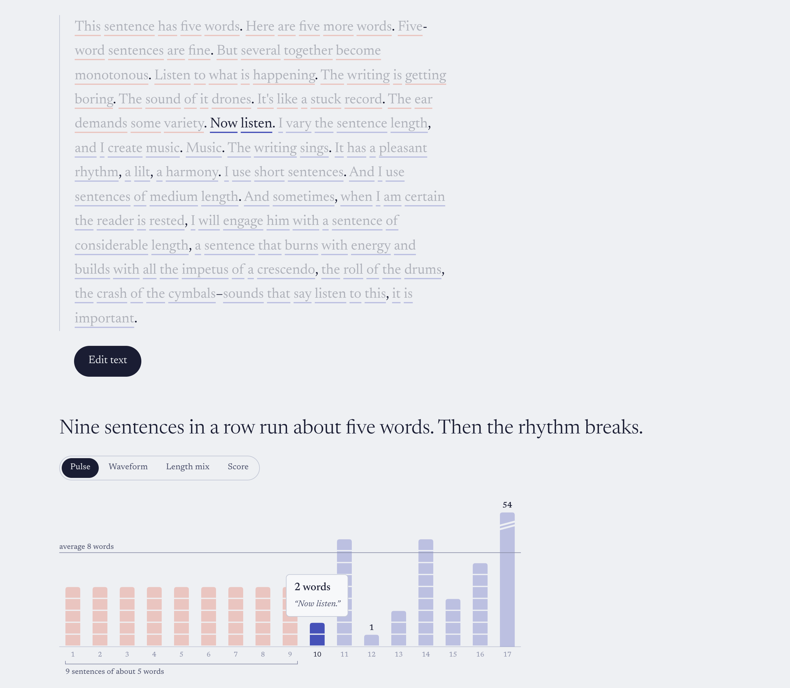
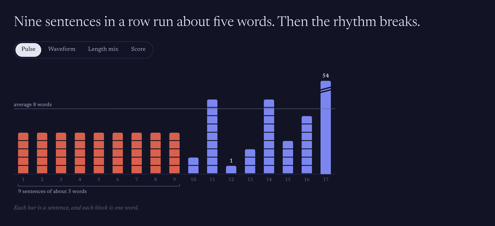
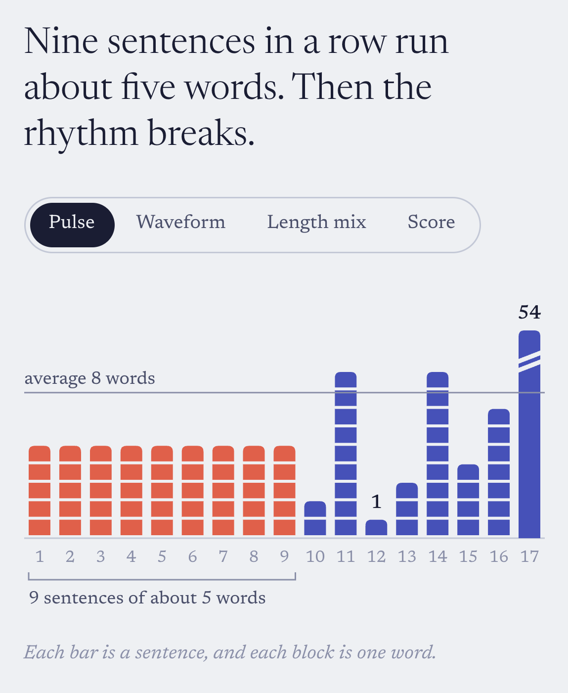
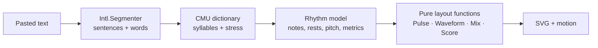

<h1 align="center">words-viz</h1>

<p align="center"><strong>Paste a paragraph. See how it sounds.</strong></p>

<p align="center">
  
</p>

<p align="center">
  <em>Every word flies from your paragraph into the chart, in reading order.</em>
</p>

---

## The idea

> "This sentence has five words. Here are five more words."
> — Gary Provost

While reading _Keys to Great Writing_ by Stephen Wilbers, I got stuck on the chapter about the
**music of prose**. Its point is simple: writing has rhythm. Sentences of the same length drone,
and sentences that vary short, medium and long make the writing sing.

You can hear that when you read aloud, but you can't _see_ it. **words-viz makes the rhythm of a
paragraph visible.** Paste any paragraph and in about a second you get:

- **one plain-English verdict**, like _"Nine sentences in a row run about five words. Then the
  rhythm breaks."_
- **four ways to look at the rhythm**, from obvious to musical
- **your paragraph, linked to the chart.** Hover a bar and its sentence lights up.

Everything runs in your browser. Nothing is uploaded.

<p align="center">
  
</p>

## Four ways to hear a paragraph

### Pulse: how long is each sentence?



One bar per sentence, built from one block per word, so you can count them. A run of
same-length sentences (the drone) is highlighted and labelled for you. If one sentence is far
longer than the rest, its bar gets an **axis break**, so the others aren't squashed flat. Its true
length is still printed on top.

### Waveform: where do the stresses fall?



One bar per **syllable**, tall where it's stressed and short where it isn't. You can watch the
da-DUM of the prose, and the gaps are the pauses at commas and full stops. Coral marks the word each
phrase leans on.

### Length mix: is there variety at all?



A tally of your sentences from _very short_ to _very long_. Provost's paragraph has twelve short
sentences, a crescendo of fifty-four words, and nothing in between.

### Score: the paragraph as music



The literal version of the metaphor. Each sentence is a phrase between barlines and each word is
a note. Syllables become beads, stress sets the pitch, punctuation becomes a rest, and the colour
follows the pitch from deep indigo up to coral.

## The details

<p align="center">
  
</p>

<p align="center"><em>Hover any bar, dot or note to light up its sentence and read it back.</em></p>

<table>
  <tr>
    <td width="62%"></td>
    <td></td>
  </tr>
  <tr>
    <td align="center"><em>A deliberate dark mode, with its own colours</em></td>
    <td align="center"><em>Built for phones too</em></td>
  </tr>
</table>

## Under the hood



- **No NLP service.** Sentences and words come from the browser's built-in `Intl.Segmenter`, with
  fixes for the cases it gets wrong: `Dr.` and `J. R. R.` don't end sentences, "vitamin A. Then"
  does, dialogue tags stay attached (`“Stop!” she said.`), and hard-wrapped or Windows (CRLF)
  line breaks are handled.
- **Real pronunciation.** Syllables and stress come from the 135,000-entry CMU Pronouncing
  Dictionary, loaded lazily as its own chunk while you type. Unknown words fall back to heuristics
  and are flagged. Function words like _of_ and _the_ are treated as unstressed, the way they're
  spoken.
- **A small intonation model.** Pitch drifts down across a sentence, content words rise above
  function words, the last content word before each pause gets the accent, and the punctuation
  shapes the ending: `.` resolves, `?` rises, `!` peaks, `…` hangs.
- **Honest charts.** Bars start at zero and outliers get a visible axis break rather than a squashed
  scale. Colours were checked with a colour-blindness and contrast validator in both light and
  dark mode, every chart has a hidden data table for screen readers, and the Pulse bars and Length mix
  dots can be reached with the keyboard.
- **Tested where it matters.** The analysis and every chart layout are pure functions covered by
  59 Vitest tests. Provost's paragraph is the golden test case: _nine five-word sentences, then
  music._

## Design

- **One typeface:** [Newsreader](https://fonts.google.com/specimen/Newsreader), using its optical
  sizes from the display heading down to the chart labels.
- **Colour that means something:** in the Score, each pitch has its own colour, from a settled
  indigo up to a tense coral (a nod to Scriabin's colour-keyboard).
- **One moment of motion:** the word flight. Everything else stays still, and the animation is
  turned off if your system asks for reduced motion.

## Run it

Requires Node 20+.

```bash
npm install
npm run dev          # http://localhost:5173
npm test             # 59 tests
npm run build
```

With the dev server running, these regenerate the screenshots in this README:

```bash
npm run readme-shots   # README images + flight.gif → .github/readme/
npm run snapshots      # visual check of every view, light, dark and mobile → snapshots/
```

## Project structure

```
src/
  analysis/   text → Score: segmentation, prosody, rhythm, metrics, insights (pure, tested)
  score/      the Score view: staff layout + SVG
  views/      Pulse, Waveform, Length mix: pure layout() + SVG renderer each
  ui/         paragraph, word flight, view switcher, tooltip, legend
  theme/      design tokens (colour, type, motion) for light and dark
scripts/      Playwright scripts for screenshots and the README GIF
```

## What's next

- **Playback:** hear the paragraph as music, with a playhead lighting up each word.
- **Share a link:** the paragraph encoded in the URL.
- **Export:** save any chart as an SVG or PNG.

## Credits

- Inspired by _Keys to Great Writing_ by Stephen Wilbers, and Gary Provost's passage on sentence
  rhythm from _100 Ways to Improve Your Writing_.
- Pronunciations from the
  [CMU Pronouncing Dictionary](http://www.speech.cs.cmu.edu/cgi-bin/cmudict) via
  [`cmu-pronouncing-dictionary`](https://github.com/words/cmu-pronouncing-dictionary).
- Built with React, TypeScript, Vite, [Motion](https://motion.dev) and d3-shape.
